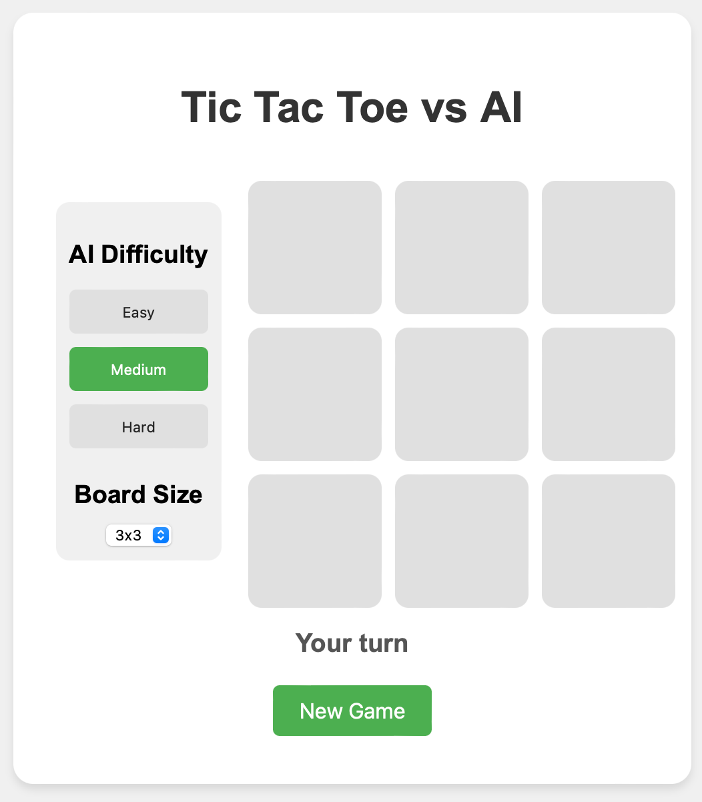
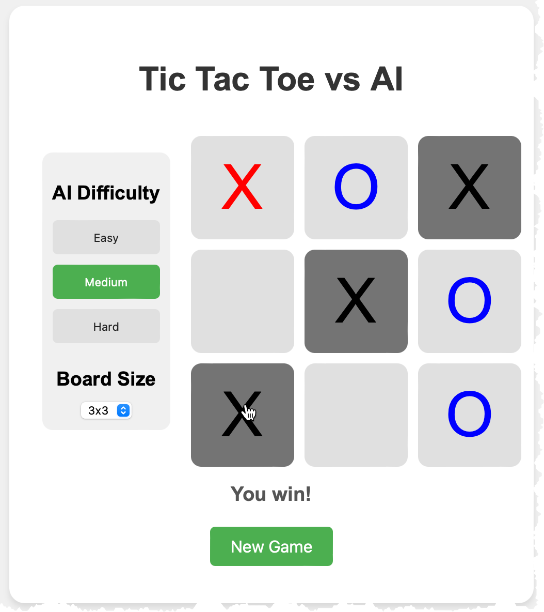
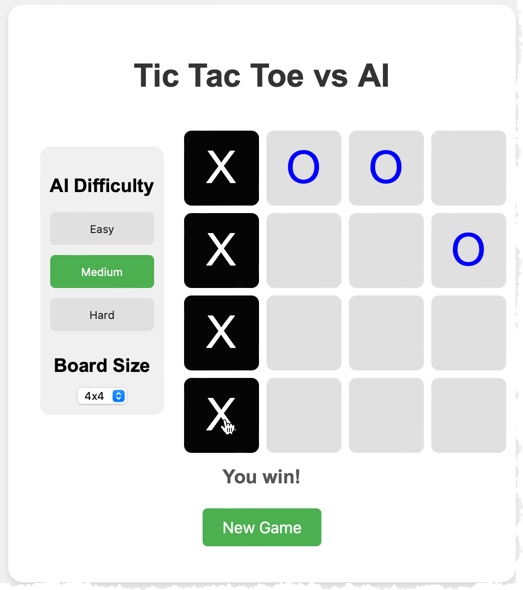

# TicTacToe Game

## Project Overview

This project is a TicTacToe game that allows users to play against a computer opponent. It provides a classic gaming experience with a modern twist, implementing an AI opponent with adjustable difficulty levels and board sizes for engaging gameplay.

### Technologies Used
- JavaScript
- HTML
- CSS

## Features

- **Single Player Mode**: Play against an AI opponent
- **Interactive Game Board**: Easy-to-use interface for making moves
- **AI Opponent**: Challenging computer player with strategic decision-making
- **Adjustable AI Difficulty**: Choose between Easy, Medium, and Hard levels
- **Adjustable Board Size**: Choose between 3x3, 4x4, and 5x5 board sizes
- **Win Detection**: Automatic detection of winning combinations
- **Game State Management**: Keeps track of the current game state
- **Restart Functionality**: Option to start a new game at any time

## Installation Instructions

1. Clone the repository:
   ```bash
   git clone https://github.com/yourusername/tictactoe.git
   ```
2. Navigate to the project directory:
   ```bash
   cd tictactoe
   ```

## Usage

1. Open the `index.html` file in your web browser.

2. Select the AI difficulty level using the buttons on the left side of the game board:
   - **Easy**: The AI makes random moves, providing a more relaxed gameplay experience.
   - **Medium**: The AI alternates between making random moves and strategic moves, offering a balanced challenge.
   - **Hard**: The AI uses the minimax algorithm to make the best possible moves, providing a tough challenge.

3. Select the board size using the dropdown menu on the left side of the game board:
   - **3x3**: Standard TicTacToe board.
   - **4x4**: Larger board for a more complex game.
   - **5x5**: Even larger board for an extended challenge.

4. Click on any empty cell to make your move. The AI will automatically respond with its move based on the selected difficulty.

5. Continue playing until there's a winner or the game ends in a draw.

6. Use the "New Game" button to start a fresh game at any time.

7. You can change the AI difficulty and board size at any point, and it will take effect in the next game.

**Note**: In Medium and Hard modes, when the user selects grid sizes 4x4 or 5x5, the computer may take a while to respond with its move. This is because the minimax algorithm used for the AI's decision-making has exponential time complexity, and larger board sizes significantly increase the number of possible moves the AI needs to evaluate.

### Screenshots

#### 3x3 Start Screen


#### 3x3 Medium Player Wins


#### 4x4 Medium Player Wins


## Logic and Architecture

The TicTacToe game is built on a simple yet effective architecture:

1. **Game Board**: Represented as a grid (3x3, 4x4, or 5x5), storing the state of each cell (empty, X, or O).

2. **Player Input**: Captures user clicks on the game board and updates the game state accordingly.

3. **AI Logic**: 
   - Easy: Uses a random move selection algorithm.
   - Medium: Alternates between random moves and the minimax algorithm.
   - Hard: Consistently uses the minimax algorithm for optimal play.

4. **Win Detection**: After each move, checks for winning combinations horizontally, vertically, and diagonally.

5. **State Management**: Keeps track of the current player, game status (in progress, won, or draw), and updates the UI accordingly.

6. **Rendering**: Updates the game board display after each move, showing X's and O's in their respective positions.

7. **Difficulty and Board Size Adjustment**: Allows real-time changes to the AI's playing strategy and board size based on user selection.

This architecture ensures a smooth gaming experience while providing a challenging and adaptable AI opponent for players to enjoy.

## Contributing

Contributions are welcome! Please feel free to submit a Pull Request.

## License

MIT License
